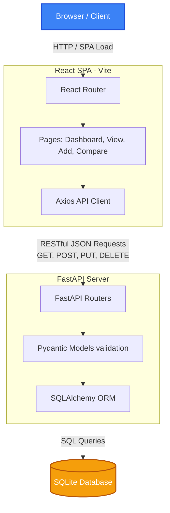
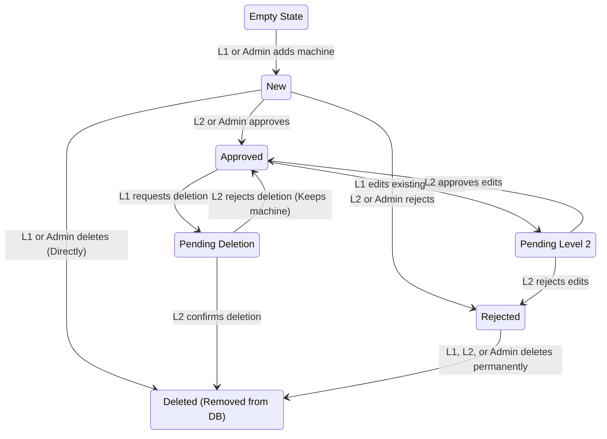
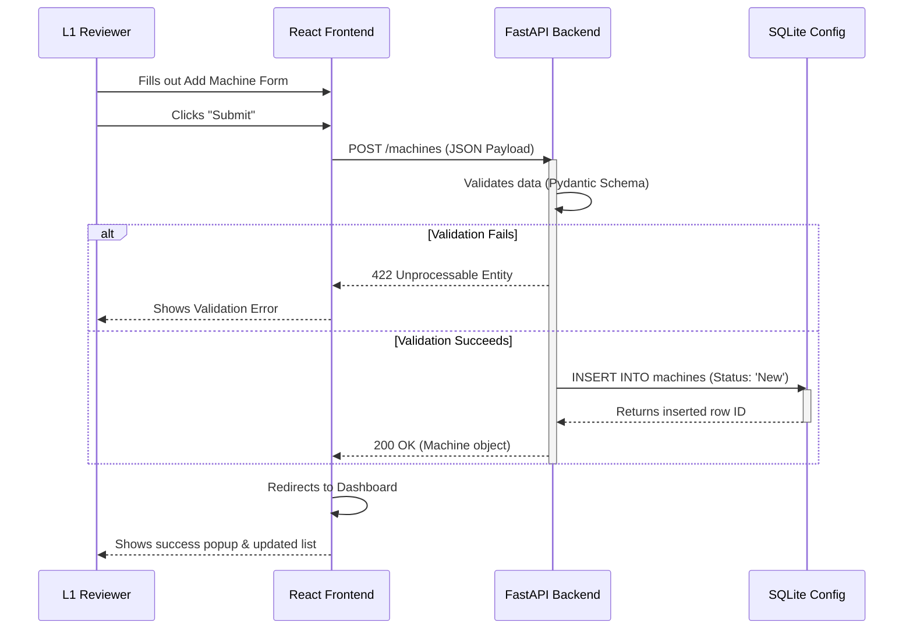
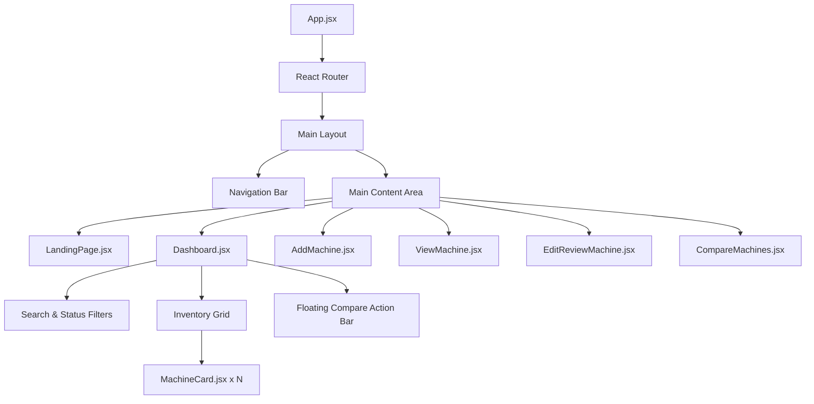

# Coffee Machine Portal - Architecture Diagrams

You can use these Mermaid diagrams to visualize the architecture, data flow, and state transitions of the application. If your markdown viewer supports Mermaid, these will map out automatically!

## 1. High-Level System Architecture

This diagram shows the overall structure of the React Frontend, FastAPI Backend, and SQLite Database.

## 2. The Two-Level Approval State Machine

This diagram shows the strict lifecycle of a `Machine` entity and the roles that govern its `status`.

## 3. Data Flow: Adding a New Machine

This sequence diagram illustrates the step-by-step traffic when an L1 User submits a new coffee machine.

## 4. Frontend Component Tree

This maps out how the React UI is structured and nested.

